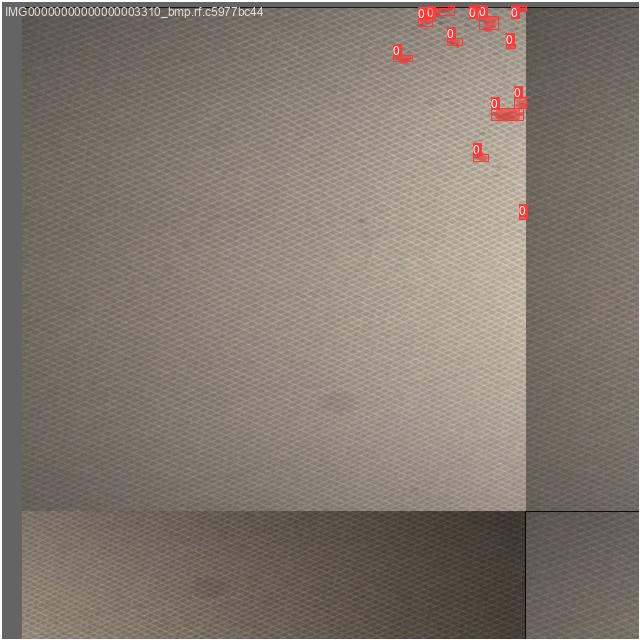
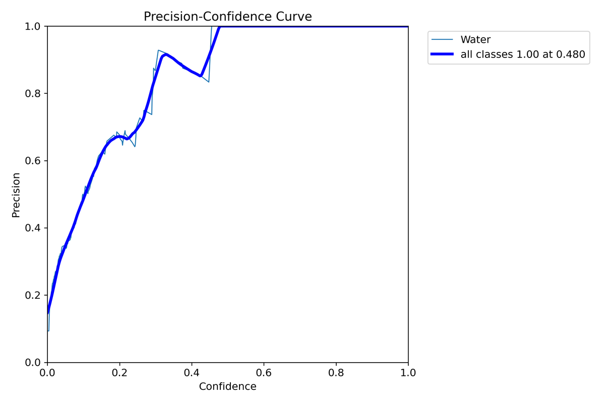
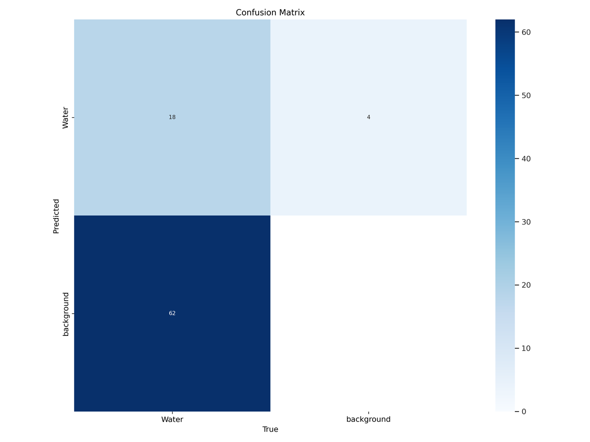
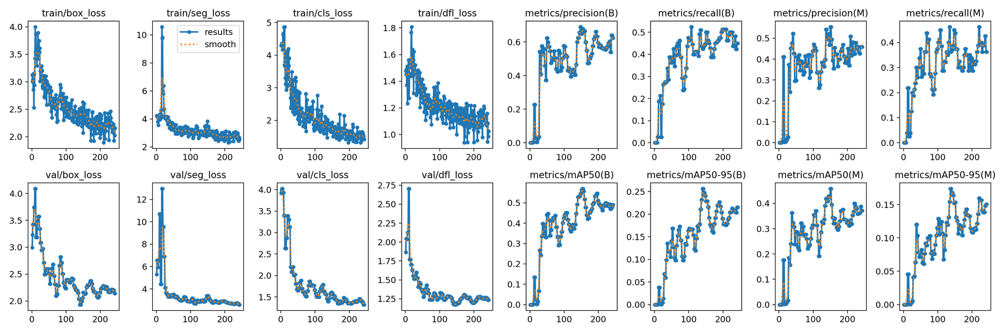
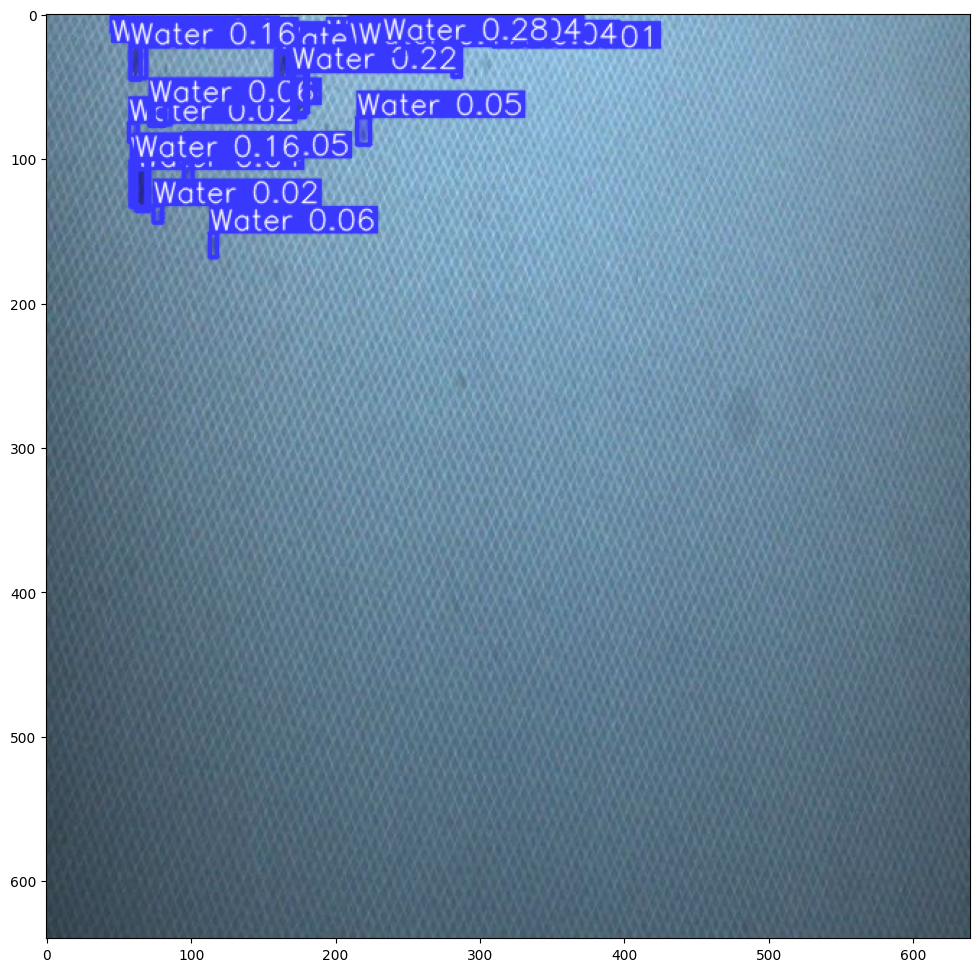
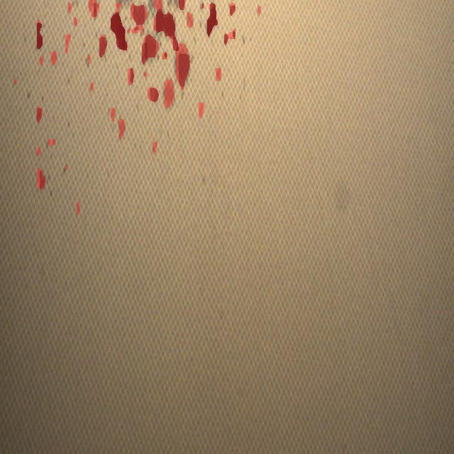
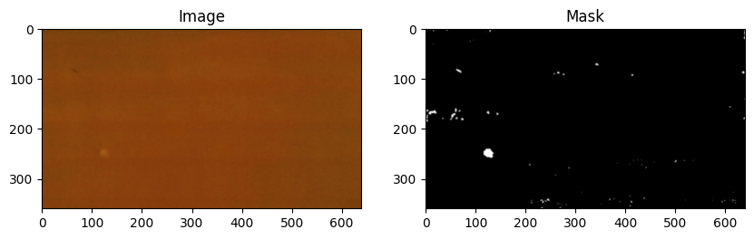
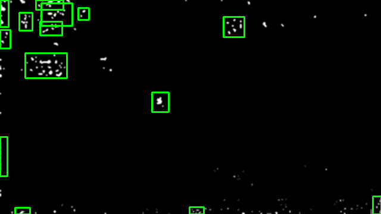
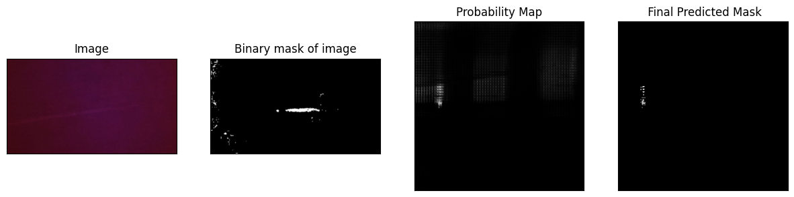
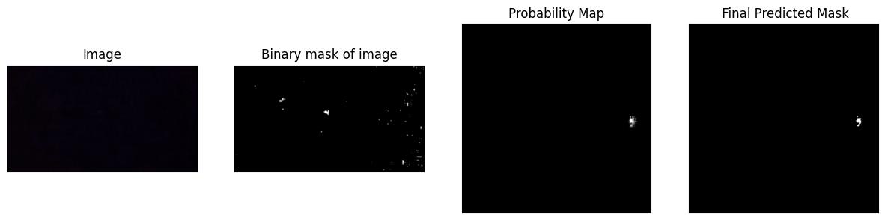

# Fabric Defect Detection

Two approaches to locating defects on textile surfaces, both built on pretrained vision models and fine-tuned in Colab. Developed during a live project with the California Institute of Technology (summer 2024).

| Notebook | Approach | Idea |
|---|---|---|
| `yolov8seg.ipynb` | YOLOv8n-seg instance segmentation | Transfer-learn Ultralytics YOLOv8 nano segmentation on a labelled textile dataset to get a box and a pixel mask per defect |
| `TextileSam (7).ipynb` | Fine-tuned Segment Anything (SAM) | Freeze SAM's image and prompt encoders, train only the mask decoder, and generate box prompts automatically from ground-truth masks |


## 1. YOLOv8 instance segmentation

[](https://colab.research.google.com/github/diyasharma05/Fabric_Detection/blob/main/yolov8seg.ipynb)

- **Dataset** - Roboflow Universe [textilev3](https://universe.roboflow.com/thejagstudio-eymar/textilev3/dataset/1) (CC BY 4.0): one defect class, 640 x 640 images, YOLO-seg labels with train / valid / test splits.
- **Model** - `yolov8n-seg.pt` pretrained weights as the starting point (3.26 M parameters, 12 GFLOPs).
- **Training** - image size 640, batch size 1. The committed run is a short 3-epoch trial; the 300-epoch configuration is in the notebook.
- **Inference** - predictions at a low confidence threshold (0.01) to surface faint defects, mask polygons pulled out via `Masks.xyn` / `Masks.xy`, and a label-free render for clean overlays.

| Training batch with labels | Mask precision-confidence curve |
|---|---|
|  |  |

| Confusion matrix | Training curves |
|---|---|
|  |  |

| Prediction with boxes and masks | Same image, masks only |
|---|---|
|  |  |

## 2. Segment Anything, fine-tuned

[](https://colab.research.google.com/github/diyasharma05/Fabric_Detection/blob/main/TextileSam%20(7).ipynb)

- **Data** - 309 fabric images (360 x 640) with binary defect masks, loaded into a Hugging Face `Dataset`.
- **Prompt generation** - the hard part. Defects are tiny and fragmented, so one box around the whole mask is useless and naive per-contour boxes produce hundreds. `promptbox()` Gaussian-blurs and thresholds the mask, applies a morphological close, drops contours under 100 px², and pads each remaining bounding box. On the example mask this takes 30+ raw boxes down to about a dozen usable prompts.
- **Model** - `facebook/sam-vit-base` through `transformers`. The vision encoder and prompt encoder are frozen; only the mask decoder trains.
- **Training** - Adam at lr 1e-5, MONAI `DiceCELoss` (sigmoid, squared prediction), 155 batches per epoch. Mean training loss falls from 17.17 to 16.38 over 20 epochs; a 5-epoch run is kept for comparison.
- **Inference** - box-prompted masks visualised next to the input and the ground truth.

| Image and its defect mask | Auto-generated box prompts on a mask |
|---|---|
|  |  |

| Inference after 20 epochs | Inference after 5 epochs |
|---|---|
|  |  |

## Repository contents

| File | What it is |
|---|---|
| `yolov8seg.ipynb` | YOLOv8n-seg transfer learning, result plots, prediction, mask extraction |
| `TextileSam (7).ipynb` | Data loading, prompt-box generation, SAM decoder fine-tuning, inference |
| `assets/` | Figures exported from the notebooks |

## Running it

Both notebooks open in Colab with the badges above. Data paths point at Google Drive folders (`yolosegmentation/` and `fabric_sam/`); update them to your own copies of the datasets.

```bash
pip install ultralytics                            # YOLOv8 notebook
pip install transformers datasets monai patchify   # SAM notebook
```

## Limitations and next steps

- The YOLOv8 figures come from a 3-epoch trial. The 300-epoch run is needed for a fair mAP number.
- The SAM loss magnitude suggests masks were fed in the 0-255 range rather than 0-1. Normalising them should give a much stronger training signal.
- Prompt boxes come from ground-truth masks, so at test time they would have to come from a detector. The obvious pipeline is YOLOv8 proposes, SAM refines.
- Single-class, small datasets. A production system would need a multi-class defect taxonomy (holes, stains, broken yarn) and far more images.

## References

- Kirillov et al., *Segment Anything*, ICCV 2023.
- Jocher, Chaurasia and Qiu, *Ultralytics YOLOv8*, 2023.
- Cardoso et al., *MONAI: An open-source framework for deep learning in healthcare*, 2022.
- Roboflow Universe, *textilev3* dataset (thejagstudio-eymar), CC BY 4.0.

## Author

**Diya Sharma** - [GitHub](https://github.com/diyasharma05) · [LinkedIn](https://www.linkedin.com/in/diya-sharma-6a2210272/)
